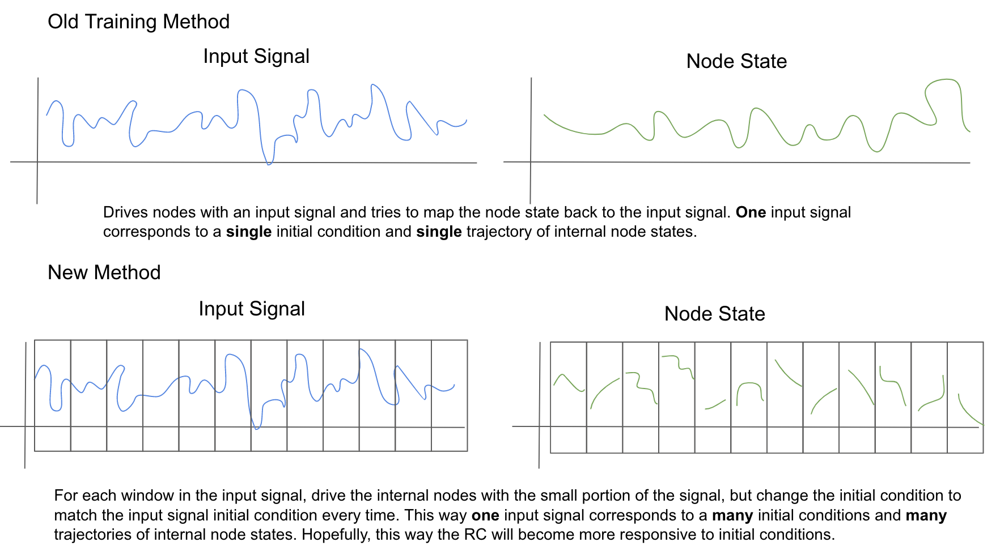

# RCAlgorithm Blueprint:

## Summary

Instead of training reservoir computers on a stream of continuous data, break up the data into subintervals and reset the initial condition for each subinterval.

## Plan

**To Do**

1. Handwrite algorithm carefully
    - [x] Describe typical algorithm
    - [x] Descibe how W_out should project all internal states to external simulaneously
    - [x] How to break up training data
    - [x] Evolution of initial condition to create a new inital condition
    - [x] Overlap and window size
    - [x] Batch update

2. Draft arguments for algorithm application pros and cons
    - [ ] Application to attractors
    - [ ] Reservoir computer learns from how the data acts in certain situations
    - [ ] Better connection between internal state of reservoir

3. Generate explanitory figures
    - [x] Standard algorithm diverging with an unseen but nearby initial condition
    - [ ] New algorithm handling unseen initials

4. Streamline RC class (Remove extra features)
    - [ ] (Reach) Make RC class into python package
    - [x] Make the class so that you can run experiments with it.

5. Talk to Peter.
    - [x] Pitch algorithm.
    - [x] Ask what he thinks is the best course to take with this.
    - [x] Does he have anyone that would be interested in working on this project with me?
    - [x] How should I include Dr. Webb on this project?
    - [ ] Advice on how I should pick a publication.

6. Measurement of attractor reconstruction
    - [ ] Lyapunov Time
    - [x] Fourier norm
    - [x] Solution norm
    - [ ] Lyapunov Exponents
         - [x] [1-d Python code](http://systems-sciences.uni-graz.at/etextbook/sw2/lyapunov.html)
         - [x] [Python package](https://pypi.org/project/nolds/)
    - [x] Where does the classic algorithm fail?

8. Experiments
    - [x] What data would be the most convincing
    - [ ] Only a few parameter values
    - [x] How to deal with randomness, multiple trials, initial condition, etc.. Test in Jupyter.
    - [ ] Plan how to submit the experiments [(Execute bash from python)](https://stackoverflow.com/questions/13745648/running-bash-script-from-within-python)
    - [x] Train on attractor or not
    - [ ] Show results of different initial condition functions

7. Other Chaotic Systems
    - [x] [From this thesis](https://publishup.uni-potsdam.de/opus4-ubp/frontdoor/deliver/index/docId/4819/file/dietrich_diplom.pdf)
    - [x] Test in Jupyter
    - [x] Find appropriate parameter values
    - [x] Find appropriate initial condition draws
    - [x] Time until the system reaches attractor

9. Run Experiments on the cluster
    - [x] Write file counting script
    - [x] Write data compilation script
    - [x] Run small tests to check for bugs

10. Plots
    - [ ] Vector field with initial conditions
    - [ ] Node evolution plus fixed point evolution from different initials
    - [ ] Window training fixed points v.s. node states

11. Write paper
    - [x] Create bibliography
    - [x] Introduction
    - [x] Explain reservoir computing with images from the slides
    - [ ] Background on learning dynamical systems
    - [x] Explain new algorithm
    - [x] Evidence that the algorithm is better
    
12. Soft Robot Example
    - [x] Make input driven rc
    - [x] Find good hyper-parameters
    - [x] Train on all data
    - [ ] Window train on all data
         - Show results of different initial condition functions
        
13. Rerun synthetic experiments
    - [ ] Lyapunov time
    - [x] Lyap. Exponents Correctly
    - [x] System norm
    - [x] Different initial condition functions
    - [x] Correct fixed point initial
    - [ ] Implement NRMSE and VPT
    - [ ] Implement input scaling

14. Explore efficacy of the initial condition function
    - [ ] Linear independence of the trajectories
    - [ ] Rank of matrix
    - [ ] Are the orbits too similar?

## Ideas to Explore
* Plot the movement of the fixed points along with the orbit of the reservoir nodes
    - Use a training signal that is easy to understand
    - Show the effect of different kinds of readin matrixes on the movement of fixed points
    - Measure the effectiveness of the different readins on linear independence of the signals
    - Show a link between linear independence and learning ability
    - We want to know the derivative of the fixed point.
* Use an intercept vector instead of just a readout to eliminate the need for steady state solutions
    - Make one node state fixed at 1.
* Implement some standard error measures
* Solution error may not be needed to show what I'm trying to show
* Asymptotic root finding for solving for the fixed points. Add an epsilon term in front of the activation function.
* Drop node states and recompute Tikhanov regression. Check if the error is always lower.
* Scale each input dimension differently (to interval from [0, 1]) before passing into reservoir computer.
* Does gamma affect the ability of the reservoir node to track the fixed point? Does high gamma allow it to move faster?
